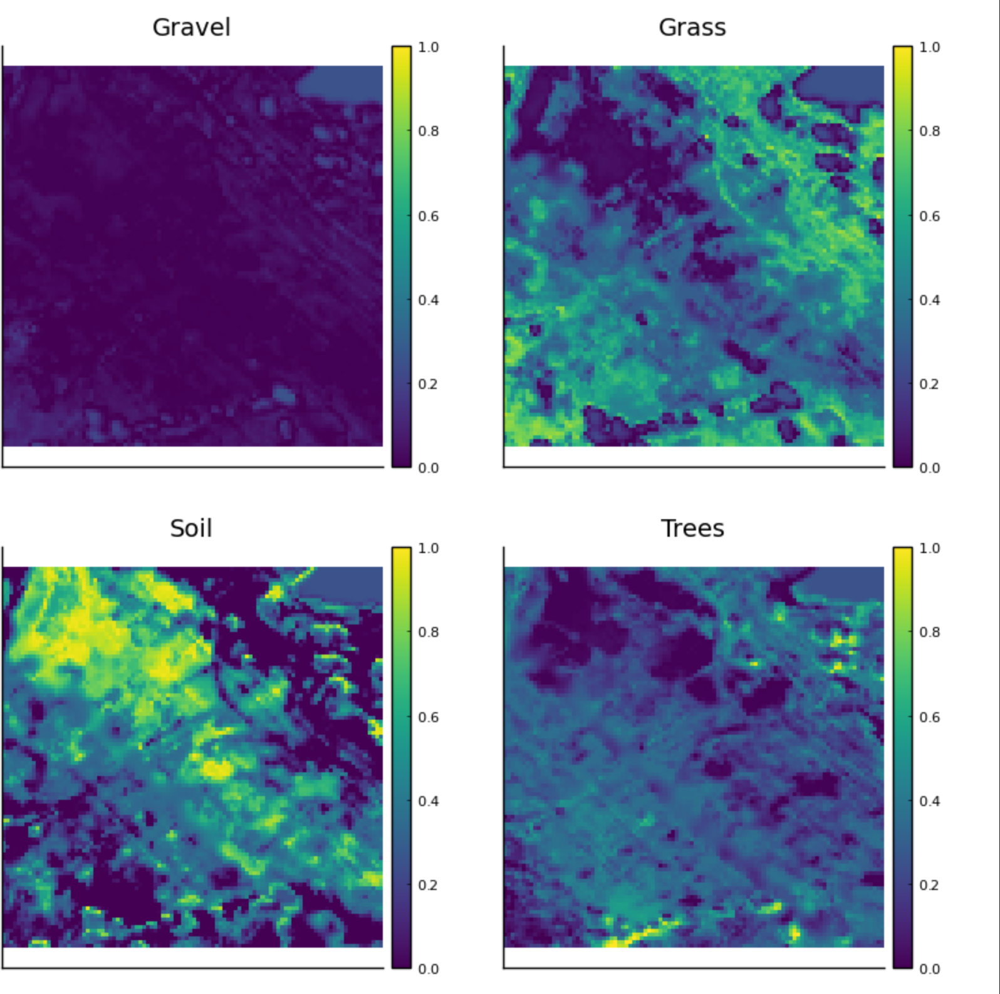

# High-Performance Hyperspectral Unmixing with Julia

This repository contains a high-performance implementation of Hyperspectral Image Unmixing using **Julia**. The project focuses on solving the Blind Source Separation problem under physical constraints using **Projected Gradient Descent (PGD)**.

To address the computational challenges posed by massive hyperspectral datasets, this implementation leverages Julia's native **Parallel and Distributed Computing** capabilities, comparing sequential execution against multi-core distributed strategies.

## Overview

Hyperspectral imaging captures a wide spectrum of light for each pixel in an image, allowing for the identification of materials based on their spectral signatures. However, due to low spatial resolution, pixels often contain a mixture of different materials.

The goal of this project is to decompose a hyperspectral image $X$ into:
1.  **Endmembers ($W$):** The spectral signatures of pure materials.
2.  **Abundances ($H$):** The proportion of each material in every pixel.

## Mathematical Formulation

The problem is modeled using the Linear Mixing Model (LMM). Given an observed data matrix $X \in \mathbb{R}^{L \times N}$, we seek to factorize it as:

$$X \approx WH$$

To retrieve matrices $W$ and $H$, we solve the following optimization problem:

$$\min_{W, H} \frac{1}{2} ||X - WH||_F^2$$

Subject to physical constraints:
* **Non-negativity:** $W \geq 0, H \geq 0$
* **Sum-to-one:** The sum of abundances for a given pixel must equal 1.

## Implementation Strategy

The optimization is performed using an iterative Projected Gradient Descent. The core computational bottleneck lies in the update of the Abundance matrix ($H$), which requires solving a constrained least-squares problem for every pixel.

### Parallelization Approaches
Since the pixel updates are independent, the problem is classified as **embarrassingly parallel**. We implemented and benchmarked two parallel strategies using the `Distributed` standard library:

1.  **Data Parallelism:** Manual distribution of data blocks across workers.
2.  **Task Parallelism (`pmap`):** Dynamic load balancing where each pixel (or chunk of pixels) is treated as an independent task.

## Dependencies

The project is written in **Julia** (v1.6+). The following packages are required:

* `Distributed` (Standard library)
* `SharedArrays` (Standard library)
* `LinearAlgebra` (Standard library)
* `MAT.jl` (For reading .mat hyperspectral datasets)
* `Plots.jl` (For visualization)
* `Images.jl` (For image rendering)

## Usage

1.  **Clone the repository:**
    ```bash
    git clone [https://github.com/YourUsername/Hyperspectral-Unmixing-Julia.git](https://github.com/YourUsername/Hyperspectral-Unmixing-Julia.git)
    cd Hyperspectral-Unmixing-Julia
    ```

2.  **Data Setup:**
    Place your hyperspectral dataset (e.g., `project_data.mat`) in the root directory.
    *Note: The dataset is not included in this repository due to size constraints.*

3.  **Run the Notebook:**
    Open `parallelization_julia.ipynb` in Jupyter Notebook or VS Code to reproduce the results.

    ```julia
    using Pkg
    Pkg.instantiate() # Install dependencies
    ```

## Results & Performance

### 1. HPC Acceleration (Speedup x12)
The optimization process (Projected Gradient Descent) is computationally intensive. By leveraging Julia's **Distributed Computing** capabilities (`pmap` vs sequential loop), we achieved a massive reduction in computation time.

* **Sequential Time:** ~321 seconds
* **Parallel Time:** ~25 seconds
* **Speedup:** **12.7x**


### 2. Spectral Reconstruction Accuracy
The algorithm successfully recovers the underlying physical structure of the data. The plot below compares the **Ground Truth** (actual material signature) with the **Reconstructed Model**, showing high accuracy.


### 3. Material Mapping (Abundance Maps)
Below are the generated heatmaps showing the spatial distribution of different materials identified in the scene. The algorithm correctly separates distinct features (e.g., roads, fields).

.


## Authors

* **Paul Trassaert**
* **Mohamed Aziz Jallouli**
* **Nathan Ygé**

---
*This project was developed as part of the Numerical Methods curriculum at IMT Atlantique.*
